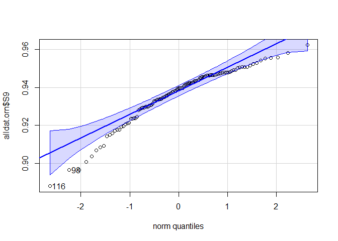
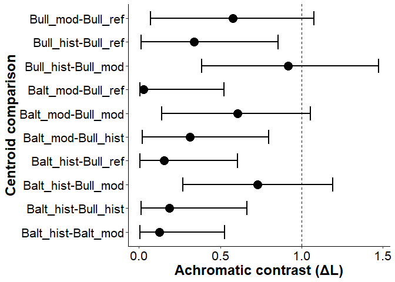

Main code
================
6/18/2021

  - [Load libraries](#load-libraries)
  - [Import data](#import-data)
      - [Attribute data](#attribute-data)
      - [Spectra data](#spectra-data)
      - [Visually check spectra](#visually-check-spectra)
          - [Fix odd peaks](#fix-odd-peaks)
      - [Average spectra](#average-spectra)
      - [Smooth spectra](#smooth-spectra)
  - [Split orange and black patches](#split-orange-and-black-patches)
      - [Extract orange patches](#extract-orange-patches)
      - [Extract black patches](#extract-black-patches)
  - [Colorimetric variables](#colorimetric-variables)
      - [Compare boxplots across specimen
        categories](#compare-boxplots-across-specimen-categories)
      - [Check data](#check-data)
  - [Statistical analyses](#statistical-analyses)
      - [H1. Have specimens faded over
        time?](#h1-have-specimens-faded-over-time)
          - [1. Orange patches over time](#1-orange-patches-over-time)
          - [2. Black patches over time](#2-black-patches-over-time)
      - [H2. Have landuse changes affected Bullock’s
        orioles?](#h2-have-landuse-changes-affected-bullocks-orioles)
      - [H3. Are color changes only in the hybrid
        zone?](#h3-are-color-changes-only-in-the-hybrid-zone)

The following analyses is conducted on spectra data for 119 specimens.
Sample sizes for each specimen category compose of the following:

| Bullock’s oriole |        |           | Baltimore oriole |        |
| ---------------- | ------ | --------- | ---------------- | ------ |
| Historic         | Modern | Reference | Historic         | Modern |
| 20               | 20     | 40        | 20               | 19     |

Bullock’s reference specimens come from the Museum of Vertebrate Zoology
(MVZ; n = 20) and the University of Washington Burke Museum (UWBM; n =
20).

**Set up**: integration time, 100 ms; 10 readings averaged per
recording; boxcar width 10

Each specimen has 5 patches measured (2 black 3 orange) and each patch
is measured 3 times; i.e. 15 measurements per specimen.


<br>

### Load libraries

Using `pavo` as main, rest as data manipulation & organization

``` r
library(pavo)
library(data.table)
library(readxl)
library(tidyverse)
library(stringr)
library(knitr)
library(car)
library(ggpubr)
library(ggpmisc)
library(lme4)
```

Set ggplot themes for figures

``` r
mytheme <- theme(
  plot.title = element_text(size=20,face="bold",color="black"),      
  axis.text=element_text(size=16, color="black"),
  axis.title=element_text(size=18,face="bold",color="black"),
  axis.text.x=element_text(size=16, color="black"), 
  axis.text.y=element_text(size=16, color="black"),
  legend.text = element_text(size=16, color="black"),
  legend.title = element_text(size=16, color="black", face="bold"))

pal1 <- c("#58508d", "#ffa600")
```

# Import data

## Attribute data

Load `specimen_info.xls` & filter out necessary info

``` r
attributes <- read_excel("oriole_specimen_info.xlsx")
knitr::kable(head(attributes))
```

| ID      | sp\_id          | cat        | Cat Num | Species | Code             | CollectionDate | State | Higher Geography                     | Specific Locality                                  |
| :------ | :-------------- | :--------- | ------: | :------ | :--------------- | :------------- | :---- | :----------------------------------- | :------------------------------------------------- |
| BA28299 | Balt\_Historic1 | Balt\_hist |       1 | 28299   | Baltimore Oriole | 1957-06-12     | NE    | United States, Nebraska, Polk County | Platte River, 3 miles South-Southwest Silver Creek |
| BA28300 | Balt\_Historic2 | Balt\_hist |       2 | 28300   | Baltimore Oriole | 1957-06-12     | NE    | United States, Nebraska, Polk County | Platte River, 3 miles South-Southwest Silver Creek |
| BA28301 | Balt\_Historic3 | Balt\_hist |       3 | 28301   | Baltimore Oriole | 1957-06-12     | NE    | United States, Nebraska, Polk County | Platte River, 3 miles South-Southwest Silver Creek |
| BA28302 | Balt\_Historic4 | Balt\_hist |       4 | 28302   | Baltimore Oriole | 1957-06-13     | NE    | United States, Nebraska, Polk County | Platte River, 3 miles South-Southwest Silver Creek |
| BA28304 | Balt\_Historic5 | Balt\_hist |       5 | 28304   | Baltimore Oriole | 1957-06-13     | NE    | United States, Nebraska, Polk County | Platte River, 3 miles South-Southwest Silver Creek |
| BA28305 | Balt\_Historic6 | Balt\_hist |       6 | 28305   | Baltimore Oriole | 1957-06-13     | NE    | United States, Nebraska, Polk County | Platte River, 3 miles South-Southwest Silver Creek |

``` r
attributes$date <- as.Date(attributes$CollectionDate, origin = "1899-12-30")

att <- attributes[,c("ID", "sp_id", "cat", "date", "Code")]
att$cat <- as.factor(att$cat)

# Just IDs and category
idcat <- att[,c("ID", "cat")]
```

<br>

## Spectra data

Finds and imports spectra files from a folder `allspec` and `burke`.
Contains replicated data for one missing measurement.

``` r
spec <- getspec("allspec", ext = "txt", lim = c(300, 700))  # 1485 files
spec <- as.rspec(spec)

burke <- getspec("burke", ext = "txt", lim = c(300, 700)) #300 files
```

## Visually check spectra

``` r
plot(spec)
```


``` r
plot(burke)
```


### Fix odd peaks

Measurements for the Burke museum specimen have two peaks in the spectra
that occur for unknown reasons. They were replaced by deleting
reflectance at those wavelengths and interpolating the values from
before/after. The areas of concern seem to be 470-500 nm and 510-560 nm.

1.  Replace odd wavelengths with `NA`
2.  Use `as.rspec` to interpolate gaps

<!-- end list -->

``` r
wl <- burke$wl

# replace with NA
burke$wl <- as.numeric(burke$wl)

burke[which(burke$wl > 470 & burke$wl < 500),] <- NA
burke[which(burke$wl > 515 & burke$wl < 560),] <- NA

burke[,1] <- wl # feed back in because it gets deleted

# Interpolate
burke <- as.rspec(burke)

# join 
allspec <- merge(spec, burke)
```

3.  Check new spectra

<!-- end list -->

``` r
plot(burke)
```


<br>

## Average spectra

Modify names for future processing.

## Smooth spectra

Suitable soothing parameter `span = 0.14` is the minimum amount of
smoothing to remove spectral noise.

``` r
# check which smoothing parameter to use
plotsmooth(m.allspec, minsmooth = 0.05, maxsmooth = 0.5, curves = 6, ask = FALSE, specnum = 6)
```


``` r
# smooth spectra based on that
allspec.sm <- procspec(m.allspec, opt = "smooth", span = 0.14, fixneg = "zero") 
```

``` r
# spectra in their colors
plot(allspec.sm, col = spec2rgb(allspec.sm), cex.lab = 1.5, cex.axis = 1.5)
```


<br>

# Split orange and black patches

### Extract orange patches

Subset then extract

``` r
allspec.orn <- subset(allspec.sm, "orn") #n=343
# average 3 measurements
allspec.orn.avg <- aggspec(allspec.orn, by = 3, FUN = mean, trim = FALSE) 
```

Get spetra

``` r
# get names from list
allspecimens <- names(allspec.orn.avg)
allds <- as.data.frame(allspecimens)

# change names to match
allds$ID <- gsub("MVZ_", "MVZ", allds$allspecimens)
idcat$ID2 <- gsub("MVZ.", "MVZ", idcat$ID)
idcat$ID2 <- gsub("UWBM.", "UWBM", idcat$ID2)
idcat$ID2 <- gsub("UWBMBU", "UWBM", idcat$ID2)


allds$ID2 <- gsub("\\_.*", "", allds$ID) #extract values before _
allds$patch <- gsub(".*_", "", allds$allspecimens) #extract values after _

idcat <- rbind(idcat, data.frame(ID = "wl", cat= "wl", ID2 = "wl")) # to match

# Check if specimen numbers match
# n_distinct(allds$ID2) #n=120
# n_distinct(ct$ID2) #n=120

# Create a new column with specimen type and patch
allds2 <- allds %>% 
  left_join(idcat, by = "ID2", keep=FALSE) 

# Create separate string for category list
allcategory <- allds2$cat
```

Plot average spectra

``` r
# plot by specimen
asoa <- allspec.orn.avg
colnames(asoa) <- allcategory

aggplot(asoa, by = allcategory, FUN.center = median, ylim = c(0, 65),
        alpha = 0.3, legend = F, cex.lab = 1.5, cex.axis = 1.5, lwd=2)
legend(290, 67, legend = c("BA historic", "BA modern", "BU historic", "BU modern", "BU reference"), col = c("red", "royalblue", "green", "purple", "orange", "yellow"), lty=1, cex=1.2, box.lty=0, lwd=2, bg="transparent")
```


Get Colorimetric variables

``` r
# use summary function
allsum.orn <- summary(allspec.orn.avg)
setDT(allsum.orn, keep.rownames = TRUE)[]

# convert MVZ names to be consistent with the specimen attribute data
allsum.orn$rn <- gsub("MVZ_", "MVZ.", allsum.orn$rn)

allid.orn <- do.call(rbind, strsplit(allsum.orn$rn, "\\_"))[, 1]

allsum.orn$ID <- allid.orn #specimen ID

# change UWBM to be consistent with the attribute data table
allsum.orn$ID <- gsub("UWBM", "UWBM.BU", allsum.orn$ID)

# Join spectra summary data with attribute data
alldat.orn <- allsum.orn %>%
  left_join(att, by = "ID", keep = F)

# Make just a species category
alldat.orn$sp <- gsub("\\_.*", "", alldat.orn$cat)
```

#### Spectra split by species

``` r
# split by species
asoa.ba <- subset(asoa, "Balt")
asoa.bu <- subset(asoa, "Bull")


allcat <- as.data.frame(allcategory)
allcat2 <- allcat %>% 
  filter(allcategory =="wl" | allcategory == "Balt_hist" | allcategory == "Balt_mod")
colnames(asoa.ba) <- allcat2$allcategory

allcat3 <- allcat %>% 
  filter(allcategory =="wl" | allcategory == "Bull_hist" | allcategory == "Bull_mod" | allcategory == "Bull_ref")
colnames(asoa.bu) <- allcat3$allcategory

# plot & save

#png("all_spectra_bullocks.png", width = 800, height = 800, pointsize = 22, res = 100, bg = "transparent")
aggplot(asoa.bu, by = allcat3$allcategory, FUN.center = median, ylim = c(0, 65),
        alpha = 0.3, legend = F, cex.lab = 1.5, cex.axis = 1.5, lwd=2)
legend(290, 67, legend = c("Historic", "Modern", "Reference"), col = c("red", "royalblue", "green"), lty=1, cex=1.2, box.lty=0, lwd=2, bg="transparent", title = "Bullock's oriole")
```

<!-- -->

``` r
#dev.off()

#png("all_spectra_baltimore.png", width = 800, height = 800, pointsize = 22, res = 100, bg = "transparent")
aggplot(asoa.ba, by = allcat2$allcategory, FUN.center = median, ylim = c(0, 65),
        alpha = 0.3, legend = F, cex.lab = 1.5, cex.axis = 1.5, lwd=2)
legend(290, 67, legend = c("Historic", "Modern"), col = c("red", "royalblue"), lty=1, cex=1.2, box.lty=0, lwd=2, bg="transparent", title = "Baltimore oriole")
```

<!-- -->

``` r
#dev.off()
```

### Extract black patches

Repeat steps above

``` r
allspec.blk <- subset(allspec.sm, "blk")

# average 3 measurements
allspec.blk.avg <- aggspec(allspec.blk, by = 2, FUN = mean, trim = FALSE) 

# Get colorimetric values
allsum.blk <- summary(allspec.blk.avg)
setDT(allsum.blk, keep.rownames = TRUE)[]

# convert MVZ names to be consistent with the specimen attribute data
allsum.blk$rn <- gsub("MVZ_", "MVZ.", allsum.blk$rn)

allid.blk <- do.call(rbind, strsplit(allsum.blk$rn, "\\_"))[, 1]

allsum.blk$ID <- allid.blk #specimen ID

allsum.blk$ID <- gsub("UWBM", "UWBM.BU", allsum.blk$ID)


# Join spectra summary data with attribute data
alldat.blk <- allsum.blk %>%
  left_join(att, by = "ID", keep = F)

# Make just a species category
alldat.blk$sp <- gsub("\\_.*", "", alldat.blk$cat)
```

<br>

# Colorimetric variables

List of variables of interest (from Pavo package; references available
there) - `B1`: total brightness; sum of relative reflectance over entire
spectral range (area under the curve) - `B2`: mean brightness; mean
relative reflectance over entire spectral range - `S1`: chroma; relative
contribution of a spectral range to the total brightness (B1) - `S9`:
carotenoid chroma; (R700 - R450)/R700 - `H3`: hue/wavelength at Rmid;
sensitive to noisy spectra

### Compare boxplots across specimen categories

Orange patches

``` r
dat <- alldat.orn
plot(B1~cat, data=dat, ylab = "Total brightness (B1)", xlab = "Specimen category")
```

<!-- -->

``` r
plot(B2~cat, data=dat, ylab = "Mean brightness (B2)", xlab = "Specimen category") # same as above, just different y axis
```

<!-- -->

``` r
plot(S9~cat, data=dat, ylab = "Carotenoid chroma (S9)", xlab = "Specimen category")
```

<!-- -->

``` r
plot(H3~cat, data=dat, ylab = "Hue (H3)", xlab = "Specimen category")
```

<!-- -->

Black patchess

``` r
dat <- alldat.blk
plot(B1~cat, data=dat, ylab = "Total brightness (B1)", xlab = "Specimen category")
```

<!-- -->

### Check data

Histograms

``` r
# Oranges
hist(alldat.orn$B1)
```

<!-- -->

``` r
hist(alldat.orn$B2)
```

<!-- -->

``` r
hist(alldat.orn$S9)
```

<!-- -->

``` r
hist(alldat.orn$H3)
```

<!-- -->

``` r
# Black
hist(alldat.blk$B1)
```

<!-- -->

Normality

``` r
# Oranges
qqPlot(alldat.orn$B1)
```

<!-- -->

    ## [1] 94 95

``` r
qqPlot(alldat.orn$B2)
```

<!-- -->

    ## [1] 94 95

``` r
qqPlot(alldat.orn$S9)
```

<!-- -->

    ## [1] 116  98

``` r
qqPlot(alldat.orn$H3)
```

<!-- -->

    ## [1] 50 43

``` r
# Black
qqPlot(alldat.blk$B1)
```

<!-- -->

    ## [1] 37 27

<br>

# Statistical analyses

## H1. Have specimens faded over time?

To test for specimen fauxing, look at colorimetric measures over time.

### 1\. Orange patches over time

Check brightness, carotenoid chroma, hue

1)  Brightness

<!-- end list -->

``` r
# Both species
lm_orn_both_b1 <- lm(B1 ~ date, data=alldat.orn)
summary(lm_orn_both_b1)
```

    ## 
    ## Call:
    ## lm(formula = B1 ~ date, data = alldat.orn)
    ## 
    ## Residuals:
    ##     Min      1Q  Median      3Q     Max 
    ## -2208.7  -423.0   111.5   558.7  1823.2 
    ## 
    ## Coefficients:
    ##              Estimate Std. Error t value Pr(>|t|)    
    ## (Intercept) 9.786e+03  7.279e+01  134.45   <2e-16 ***
    ## date        2.864e-03  5.620e-03    0.51    0.611    
    ## ---
    ## Signif. codes:  0 '***' 0.001 '**' 0.01 '*' 0.05 '.' 0.1 ' ' 1
    ## 
    ## Residual standard error: 763.6 on 117 degrees of freedom
    ## Multiple R-squared:  0.002214,   Adjusted R-squared:  -0.006314 
    ## F-statistic: 0.2596 on 1 and 117 DF,  p-value: 0.6113

``` r
# Bullock's
lm_orn_BU_b1 <- lm(B1 ~ date, data=alldat.orn[which(alldat.orn$sp == "Bull"),])
summary(lm_orn_BU_b1)
```

    ## 
    ## Call:
    ## lm(formula = B1 ~ date, data = alldat.orn[which(alldat.orn$sp == 
    ##     "Bull"), ])
    ## 
    ## Residuals:
    ##      Min       1Q   Median       3Q      Max 
    ## -2057.20  -515.73    87.37   565.12  1945.41 
    ## 
    ## Coefficients:
    ##              Estimate Std. Error t value Pr(>|t|)    
    ## (Intercept) 9.676e+03  9.139e+01 105.874   <2e-16 ***
    ## date        5.624e-03  6.931e-03   0.812     0.42    
    ## ---
    ## Signif. codes:  0 '***' 0.001 '**' 0.01 '*' 0.05 '.' 0.1 ' ' 1
    ## 
    ## Residual standard error: 804.4 on 78 degrees of freedom
    ## Multiple R-squared:  0.008372,   Adjusted R-squared:  -0.004341 
    ## F-statistic: 0.6585 on 1 and 78 DF,  p-value: 0.4195

``` r
# Baltimore
lm_orn_BA_b1 <- lm(B1 ~ date, data=alldat.orn[which(alldat.orn$sp == "Balt"),])
summary(lm_orn_BA_b1)
```

    ## 
    ## Call:
    ## lm(formula = B1 ~ date, data = alldat.orn[which(alldat.orn$sp == 
    ##     "Balt"), ])
    ## 
    ## Residuals:
    ##      Min       1Q   Median       3Q      Max 
    ## -1399.98  -304.34    99.23   363.49  1162.44 
    ## 
    ## Coefficients:
    ##               Estimate Std. Error t value Pr(>|t|)    
    ## (Intercept)  1.009e+04  1.126e+02   89.56   <2e-16 ***
    ## date        -1.176e-02  9.044e-03   -1.30    0.201    
    ## ---
    ## Signif. codes:  0 '***' 0.001 '**' 0.01 '*' 0.05 '.' 0.1 ' ' 1
    ## 
    ## Residual standard error: 615.6 on 37 degrees of freedom
    ## Multiple R-squared:  0.04371,    Adjusted R-squared:  0.01786 
    ## F-statistic: 1.691 on 1 and 37 DF,  p-value: 0.2015

``` r
# Plot both
ggplot(alldat.orn, aes(x=date, y=B1, shape = sp, color=sp)) +
  geom_point(size=2) +
  stat_smooth(method = lm, aes(fill=sp), se = T) +
  theme_classic() +
  mytheme +
  stat_fit_glance(method = "lm", label.x="right", label.y="bottom",
                        method.args = list(formula = y ~ x), size = 5, 
                        aes(label = sprintf('R^2~"="~%.3f~~italic(p)~"="~%.3f',
                                            stat(..r.squared..), stat(..p.value..))), parse = TRUE) + 
  labs(title = "Orange patches only", y = "Total brightness (B1)", x= "Collection date")  +
  scale_color_manual(values= pal1, labels = c("Baltimore", "Bullock's")) +
  scale_fill_manual(values= pal1)
```

    ## `geom_smooth()` using formula 'y ~ x'

<!-- -->

2)  Carotenoid chroma

<!-- end list -->

``` r
# Both species
lm_orn_both_s9 <- lm(S9 ~ date, data=alldat.orn)
summary(lm_orn_both_s9)
```

    ## 
    ## Call:
    ## lm(formula = S9 ~ date, data = alldat.orn)
    ## 
    ## Residuals:
    ##       Min        1Q    Median        3Q       Max 
    ## -0.050172 -0.005326  0.002971  0.009081  0.023683 
    ## 
    ## Coefficients:
    ##              Estimate Std. Error t value Pr(>|t|)    
    ## (Intercept) 9.354e-01  1.319e-03 709.333   <2e-16 ***
    ## date        2.244e-07  1.018e-07   2.204   0.0295 *  
    ## ---
    ## Signif. codes:  0 '***' 0.001 '**' 0.01 '*' 0.05 '.' 0.1 ' ' 1
    ## 
    ## Residual standard error: 0.01383 on 117 degrees of freedom
    ## Multiple R-squared:  0.03987,    Adjusted R-squared:  0.03166 
    ## F-statistic: 4.858 on 1 and 117 DF,  p-value: 0.02947

``` r
# Bullock's
lm_orn_BU_s9 <- lm(S9 ~ date, data=alldat.orn[which(alldat.orn$sp == "Bull"),])
summary(lm_orn_BU_s9)
```

    ## 
    ## Call:
    ## lm(formula = S9 ~ date, data = alldat.orn[which(alldat.orn$sp == 
    ##     "Bull"), ])
    ## 
    ## Residuals:
    ##       Min        1Q    Median        3Q       Max 
    ## -0.048236 -0.008618  0.003119  0.010649  0.025134 
    ## 
    ## Coefficients:
    ##              Estimate Std. Error t value Pr(>|t|)    
    ## (Intercept) 9.340e-01  1.647e-03 566.984   <2e-16 ***
    ## date        1.834e-07  1.249e-07   1.468    0.146    
    ## ---
    ## Signif. codes:  0 '***' 0.001 '**' 0.01 '*' 0.05 '.' 0.1 ' ' 1
    ## 
    ## Residual standard error: 0.0145 on 78 degrees of freedom
    ## Multiple R-squared:  0.0269, Adjusted R-squared:  0.01442 
    ## F-statistic: 2.156 on 1 and 78 DF,  p-value: 0.146

``` r
# Baltimore
lm_orn_BA_s9 <- lm(S9 ~ date, data=alldat.orn[which(alldat.orn$sp == "Balt"),])
summary(lm_orn_BA_s9)
```

    ## 
    ## Call:
    ## lm(formula = S9 ~ date, data = alldat.orn[which(alldat.orn$sp == 
    ##     "Balt"), ])
    ## 
    ## Residuals:
    ##       Min        1Q    Median        3Q       Max 
    ## -0.040891 -0.004822  0.002226  0.006510  0.020737 
    ## 
    ## Coefficients:
    ##              Estimate Std. Error t value Pr(>|t|)    
    ## (Intercept) 9.385e-01  2.208e-03 425.044   <2e-16 ***
    ## date        2.455e-07  1.773e-07   1.385    0.174    
    ## ---
    ## Signif. codes:  0 '***' 0.001 '**' 0.01 '*' 0.05 '.' 0.1 ' ' 1
    ## 
    ## Residual standard error: 0.01207 on 37 degrees of freedom
    ## Multiple R-squared:  0.04929,    Adjusted R-squared:  0.02359 
    ## F-statistic: 1.918 on 1 and 37 DF,  p-value: 0.1743

``` r
# Plot both
ggplot(alldat.orn, aes(x=date, y=S9, shape = sp, color=sp)) +
  geom_point(size=2) +
  stat_smooth(method = lm, aes(fill=sp), se = T) +
  theme_classic() +
  mytheme +
  stat_fit_glance(method = "lm", label.x="right", label.y="bottom",
                        method.args = list(formula = y ~ x), size = 5, 
                        aes(label = sprintf('R^2~"="~%.3f~~italic(p)~"="~%.3f',
                                            stat(..r.squared..), stat(..p.value..))), parse = TRUE) + 
  labs(title = "Orange patches only", y = "Carotenoid chroma (S9)", x= "Collection date")  +
  scale_color_manual(values= pal1, labels = c("Baltimore", "Bullock's")) +
  scale_fill_manual(values= pal1)
```

    ## `geom_smooth()` using formula 'y ~ x'

<!-- -->

3)  Hue

<!-- end list -->

``` r
# Both species
lm_orn_both_h3 <- lm(H3 ~ date, data=alldat.orn)
summary(lm_orn_both_h3)
```

    ## 
    ## Call:
    ## lm(formula = H3 ~ date, data = alldat.orn)
    ## 
    ## Residuals:
    ##      Min       1Q   Median       3Q      Max 
    ## -18.3067  -3.7834  -0.3465   5.2359  14.6545 
    ## 
    ## Coefficients:
    ##              Estimate Std. Error t value Pr(>|t|)    
    ## (Intercept) 5.519e+02  6.902e-01 799.599   <2e-16 ***
    ## date        1.104e-04  5.329e-05   2.072   0.0405 *  
    ## ---
    ## Signif. codes:  0 '***' 0.001 '**' 0.01 '*' 0.05 '.' 0.1 ' ' 1
    ## 
    ## Residual standard error: 7.24 on 117 degrees of freedom
    ## Multiple R-squared:  0.03538,    Adjusted R-squared:  0.02713 
    ## F-statistic: 4.291 on 1 and 117 DF,  p-value: 0.04051

``` r
# Bullock's
lm_orn_BU_h3 <- lm(H3 ~ date, data=alldat.orn[which(alldat.orn$sp == "Bull"),])
summary(lm_orn_BU_h3)
```

    ## 
    ## Call:
    ## lm(formula = H3 ~ date, data = alldat.orn[which(alldat.orn$sp == 
    ##     "Bull"), ])
    ## 
    ## Residuals:
    ##      Min       1Q   Median       3Q      Max 
    ## -16.5275  -6.3942  -0.4725   6.4996  14.2262 
    ## 
    ## Coefficients:
    ##              Estimate Std. Error t value Pr(>|t|)    
    ## (Intercept) 5.504e+02  8.871e-01 620.411   <2e-16 ***
    ## date        1.747e-04  6.728e-05   2.597   0.0112 *  
    ## ---
    ## Signif. codes:  0 '***' 0.001 '**' 0.01 '*' 0.05 '.' 0.1 ' ' 1
    ## 
    ## Residual standard error: 7.808 on 78 degrees of freedom
    ## Multiple R-squared:  0.07961,    Adjusted R-squared:  0.06781 
    ## F-statistic: 6.746 on 1 and 78 DF,  p-value: 0.01122

``` r
# Baltimore
lm_orn_BA_h3 <- lm(H3 ~ date, data=alldat.orn[which(alldat.orn$sp == "Balt"),])
summary(lm_orn_BA_h3)
```

    ## 
    ## Call:
    ## lm(formula = H3 ~ date, data = alldat.orn[which(alldat.orn$sp == 
    ##     "Balt"), ])
    ## 
    ## Residuals:
    ##     Min      1Q  Median      3Q     Max 
    ## -7.4545 -2.4008 -0.4553  2.0983  9.5450 
    ## 
    ## Coefficients:
    ##               Estimate Std. Error t value Pr(>|t|)    
    ## (Intercept)  5.562e+02  7.142e-01 778.706   <2e-16 ***
    ## date        -1.600e-04  5.735e-05  -2.789   0.0083 ** 
    ## ---
    ## Signif. codes:  0 '***' 0.001 '**' 0.01 '*' 0.05 '.' 0.1 ' ' 1
    ## 
    ## Residual standard error: 3.904 on 37 degrees of freedom
    ## Multiple R-squared:  0.1737, Adjusted R-squared:  0.1514 
    ## F-statistic:  7.78 on 1 and 37 DF,  p-value: 0.008299

``` r
# Plot both
ggplot(alldat.orn, aes(x=date, y=H3, shape = sp, color=sp)) +
  geom_point(size=2) +
  stat_smooth(method = lm, aes(fill=sp), se = T) +
  theme_classic() +
  mytheme +
  stat_fit_glance(method = "lm", label.x="right", label.y="bottom",
                        method.args = list(formula = y ~ x), size = 5, 
                        aes(label = sprintf('R^2~"="~%.3f~~italic(p)~"="~%.3f',
                                            stat(..r.squared..), stat(..p.value..))), parse = TRUE) + 
  labs(title = "Orange patches only", y = "Carotenoid chroma (S9)", x= "Collection date")  +
  scale_color_manual(values= pal1, labels = c("Baltimore", "Bullock's")) +
  scale_fill_manual(values= pal1)
```

    ## `geom_smooth()` using formula 'y ~ x'

<!-- -->

### 2\. Black patches over time

Check brightness

``` r
lm_black <- lm(B1 ~ date, data=alldat.blk)
summary(lm_black)
```

    ## 
    ## Call:
    ## lm(formula = B1 ~ date, data = alldat.blk)
    ## 
    ## Residuals:
    ##      Min       1Q   Median       3Q      Max 
    ## -1111.32  -276.65   -81.05   221.07  1402.48 
    ## 
    ## Coefficients:
    ##              Estimate Std. Error t value Pr(>|t|)    
    ## (Intercept) 1.914e+03  4.366e+01  43.837  < 2e-16 ***
    ## date        1.109e-02  3.371e-03   3.288  0.00133 ** 
    ## ---
    ## Signif. codes:  0 '***' 0.001 '**' 0.01 '*' 0.05 '.' 0.1 ' ' 1
    ## 
    ## Residual standard error: 458 on 117 degrees of freedom
    ## Multiple R-squared:  0.0846, Adjusted R-squared:  0.07678 
    ## F-statistic: 10.81 on 1 and 117 DF,  p-value: 0.001332

``` r
# plot
ggplot(alldat.blk, aes(x=date, y=B1, shape = sp, color=sp)) +
  geom_point(size=2) +
  stat_smooth(method = lm, aes(fill=sp), se = T) +
  theme_classic() +
  mytheme +
  stat_fit_glance(method = "lm", label.x="right", label.y="bottom",
                        method.args = list(formula = y ~ x), size = 5, 
                        aes(label = sprintf('R^2~"="~%.3f~~italic(p)~"="~%.2f',
                                            stat(..r.squared..),stat(..p.value..))), parse = TRUE) + 
  labs(title = "Orange patches only", y = "Total brightness (B1)", x= "Collection date")  +
  scale_color_manual(values= pal1, labels = c("Baltimore", "Bullock's")) +
  scale_fill_manual(values= pal1)
```

    ## `geom_smooth()` using formula 'y ~ x'

<!-- -->

<br>

## H2. Have landuse changes affected Bullock’s orioles?

Compare reference vs. hybrid zone

``` r
# Set a new variable indicating hybrid zone or outside
alldat.orn$loc <- ifelse(alldat.orn$cat == "Bull_ref", "outside", "hybridzone") 

# Separate Bullock's
bullocks <- alldat.orn[which(alldat.orn$sp == "Bull"),]

# List for comparisons
bucomp <- list(c("Bull_ref", "Bull_hist"), c("Bull_hist", "Bull_mod"), c("Bull_ref", "Bull_mod"))
```

1.  Brightness

<!-- end list -->

``` r
# Boxplots
ggplot(bullocks, aes(x=cat, y=B1)) +
  stat_boxplot(aes(x=cat, y=B1), geom="errorbar", position = position_dodge(width=.75), width=.5) +
  geom_boxplot(outlier.size=1.5, position=position_dodge(width=.75), col="black", fill = "#fa8500") +
  theme_classic()+ 
  stat_compare_means(comparisons = bucomp, label.y = c(11900, 12200, 12500), method = "t.test", label = "p.signif", size = 6) +
  theme(axis.text=element_text(size=16, color="black"),
        axis.title=element_text(size=18,face="bold",color="black"),
        axis.text.x=element_text(size=16, color="black"), 
        axis.text.y=element_text(size=16, color="black"),
        legend.text = element_text(size=16, color="black"),
        legend.title = element_text(size=16, color="black", face="bold"))+
  labs(y = "Total brightness (B1)") +
  scale_x_discrete(name="Bullock's oriole", limits=c("Bull_ref", "Bull_hist", "Bull_mod"), labels=c("Reference","Historic", "Modern")) +
  ylim(7500,12500)
```

<!-- -->

2.  Chroma

3.  Hue

<br>

## H3. Are color changes only in the hybrid zone?

1.  Brightness

<!-- end list -->

``` r
# Regression over time 
ggplot(bullocks, aes(x=date, y=B1, shape = loc, color=loc)) +
  geom_point(size=2) +
  stat_smooth(method = lm, aes(fill=loc), se = T) +
  theme_classic() +
  mytheme +
  stat_fit_glance(method = "lm", label.x="right", label.y="bottom",
                        method.args = list(formula = y ~ x), size = 5, 
                        aes(label = sprintf('R^2~"="~%.3f~~italic(p)~"="~%.3f',
                                            stat(..r.squared..), stat(..p.value..))), parse = TRUE) + 
  labs(title = "Orange patches only", y = "Total brightness (B1)", x= "Collection date") +
  scale_color_manual(values= pal1) +
  scale_fill_manual(values= pal1)
```

    ## `geom_smooth()` using formula 'y ~ x'

<!-- -->

2.  Chroma

<!-- end list -->

``` r
ggplot(bullocks, aes(x=date, y=S9, shape = loc, color=loc)) +
  geom_point(size=2) +
  stat_smooth(method = lm, aes(fill=loc), se = T) +
  theme_classic() +
  mytheme +
  stat_fit_glance(method = "lm", label.x="right", label.y="bottom",
                        method.args = list(formula = y ~ x), size = 5, 
                        aes(label = sprintf('R^2~"="~%.3f~~italic(p)~"="~%.3f',
                                            stat(..r.squared..), stat(..p.value..))), parse = TRUE) + 
  labs(title = "Orange patches only", y = "Carotenoid chroma (S9)", x= "Collection date") +
  scale_color_manual(values= pal1) +
  scale_fill_manual(values= pal1)
```

    ## `geom_smooth()` using formula 'y ~ x'

<!-- -->

3.  Hue

<!-- end list -->

``` r
ggplot(bullocks, aes(x=date, y=H3, shape = loc, color=loc)) +
  geom_point(size=2) +
  stat_smooth(method = lm, aes(fill=loc), se = T) +
  theme_classic() +
  mytheme +
  stat_fit_glance(method = "lm", label.x="right", label.y="bottom",
                        method.args = list(formula = y ~ x), size = 5, 
                        aes(label = sprintf('R^2~"="~%.3f~~italic(p)~"="~%.3f',
                                            stat(..r.squared..), stat(..p.value..))), parse = TRUE) + 
  labs(title = "Orange patches only", y = "Hue (H3)", x= "Collection date") +
  scale_color_manual(values= pal1) +
  scale_fill_manual(values= pal1)
```

    ## `geom_smooth()` using formula 'y ~ x'

<!-- -->
