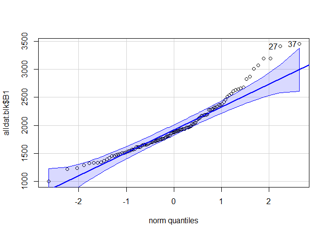

Main code
================
6/18/2021

  - [Load libraries](#load-libraries)
  - [Import data](#import-data)
      - [Attribute data](#attribute-data)
      - [Spectra data](#spectra-data)
      - [Visually check spectra](#visually-check-spectra)
          - [Fix odd peaks](#fix-odd-peaks)
      - [Average spectra](#average-spectra)
      - [Smooth spectra](#smooth-spectra)
  - [Split orange and black patches](#split-orange-and-black-patches)
      - [Extract orange patches](#extract-orange-patches)
      - [Extract black patches](#extract-black-patches)
  - [Colorimetric variables](#colorimetric-variables)
      - [Compare boxplots across specimen
        categories](#compare-boxplots-across-specimen-categories)
      - [Check data](#check-data)
  - [Statistical analyses](#statistical-analyses)
      - [H1. Have specimens faded over
        time?](#h1-have-specimens-faded-over-time)
          - [1. Orange patches over time](#1-orange-patches-over-time)
          - [2. Black patches over time](#2-black-patches-over-time)
      - [H2. Have landuse changes affected Bullock’s
        orioles?](#h2-have-landuse-changes-affected-bullocks-orioles)
      - [H3. Are color changes only in the hybrid
        zone?](#h3-are-color-changes-only-in-the-hybrid-zone)
          - [Plots](#plots)
  - [Avian visual models](#avian-visual-models)
      - [Noise-weighted distances with the Receptor Noise
        Model](#noise-weighted-distances-with-the-receptor-noise-model)
          - [Convert color distances to XYZ
            coordinates](#convert-color-distances-to-xyz-coordinates)
      - [Test for differences in
        groups](#test-for-differences-in-groups)
      - [Color space](#color-space)
          - [split by species](#split-by-species)
  - [Tetrahedral plot](#tetrahedral-plot)
  - [PCA](#pca)
      - [Within Baltimore, historic vs
        modern](#within-baltimore-historic-vs-modern)
      - [Within Bullock’s, historic vs
        modern](#within-bullocks-historic-vs-modern)
      - [Within Bullocks, all 3](#within-bullocks-all-3)
      - [Contrast between species](#contrast-between-species)
          - [Historic](#historic)
          - [Modern](#modern)

The following analyses is conducted on spectra data for 119 specimens.
Sample sizes for each specimen category compose of the following:

| Bullock’s oriole |        |           | Baltimore oriole |        |
| ---------------- | ------ | --------- | ---------------- | ------ |
| Historic         | Modern | Reference | Historic         | Modern |
| 20               | 20     | 40        | 20               | 19     |

Bullock’s reference specimens come from the Museum of Vertebrate Zoology
(MVZ; n = 20) and the University of Washington Burke Museum (UWBM; n =
20), all from CA, NE, WA, OR, AZ.

**Set up**: integration time, 100 ms; 10 readings averaged per
recording; boxcar width 10

Each specimen has 5 patches measured (2 black 3 orange) and each patch
is measured 3 times; i.e. 15 measurements per specimen.


<br>

### Load libraries

Using `pavo` as main, rest as data manipulation & organization

``` r
library(pavo)
library(data.table)
library(readxl)
library(tidyverse)
library(stringr)
library(knitr)
library(car)
library(ggpubr)
library(ggpmisc)
library(lme4)
library(cowplot)
```

Set ggplot themes for figures

``` r
mytheme <- theme(
  plot.title = element_text(size=20,face="bold",color="black"),      
  axis.text=element_text(size=16, color="black"),
  axis.title=element_text(size=18,face="bold",color="black"),
  axis.text.x=element_text(size=16, color="black"), 
  axis.text.y=element_text(size=16, color="black"),
  legend.text = element_text(size=16, color="black"),
  legend.title = element_text(size=16, color="black", face="bold"))

pal1 <- c("#ffa600", "#58508d")
```

# Import data

## Attribute data

Load `specimen_info.xls` & filter out necessary info

``` r
attributes <- read_excel("oriole_specimen_info.xlsx")
knitr::kable(head(attributes))
```

| ID      | sp\_id          | cat        | Cat Num | Species | Code             | CollectionDate | State | Higher Geography                     | Specific Locality                                  |
| :------ | :-------------- | :--------- | ------: | :------ | :--------------- | :------------- | :---- | :----------------------------------- | :------------------------------------------------- |
| BA28299 | Balt\_Historic1 | Balt\_hist |       1 | 28299   | Baltimore Oriole | 1957-06-12     | NE    | United States, Nebraska, Polk County | Platte River, 3 miles South-Southwest Silver Creek |
| BA28300 | Balt\_Historic2 | Balt\_hist |       2 | 28300   | Baltimore Oriole | 1957-06-12     | NE    | United States, Nebraska, Polk County | Platte River, 3 miles South-Southwest Silver Creek |
| BA28301 | Balt\_Historic3 | Balt\_hist |       3 | 28301   | Baltimore Oriole | 1957-06-12     | NE    | United States, Nebraska, Polk County | Platte River, 3 miles South-Southwest Silver Creek |
| BA28302 | Balt\_Historic4 | Balt\_hist |       4 | 28302   | Baltimore Oriole | 1957-06-13     | NE    | United States, Nebraska, Polk County | Platte River, 3 miles South-Southwest Silver Creek |
| BA28304 | Balt\_Historic5 | Balt\_hist |       5 | 28304   | Baltimore Oriole | 1957-06-13     | NE    | United States, Nebraska, Polk County | Platte River, 3 miles South-Southwest Silver Creek |
| BA28305 | Balt\_Historic6 | Balt\_hist |       6 | 28305   | Baltimore Oriole | 1957-06-13     | NE    | United States, Nebraska, Polk County | Platte River, 3 miles South-Southwest Silver Creek |

``` r
attributes$date <- as.Date(attributes$CollectionDate, origin = "1899-12-30")

att <- attributes[,c("ID", "sp_id", "cat", "date", "Code")]
att$cat <- as.factor(att$cat)

# Just IDs and category
idcat <- att[,c("ID", "cat")]
```

<br>

## Spectra data

Finds and imports spectra files from a folder `allspec` and `burke`.
Contains replicated data for one missing measurement.

``` r
spec <- getspec("allspec", ext = "txt", lim = c(300, 700))  # 1485 files
spec <- as.rspec(spec)

burke <- getspec("burke", ext = "txt", lim = c(300, 700)) #300 files
```

## Visually check spectra

``` r
plot(spec)
```


``` r
plot(burke)
```


### Fix odd peaks

Measurements for the Burke museum specimen have two peaks in the spectra
that occur for unknown reasons. They were replaced by deleting
reflectance at those wavelengths and interpolating the values from
before/after. The areas of concern seem to be 470-500 nm and 510-560 nm.

1.  Replace odd wavelengths with `NA`
2.  Use `as.rspec` to interpolate gaps

<!-- end list -->

``` r
wl <- burke$wl

# replace with NA
burke$wl <- as.numeric(burke$wl)

burke[which(burke$wl > 470 & burke$wl < 500),] <- NA
burke[which(burke$wl > 515 & burke$wl < 560),] <- NA

burke[,1] <- wl # feed back in because it gets deleted

# Interpolate
burke <- as.rspec(burke)

# join 
allspec <- merge(spec, burke)
```

3.  Check new spectra

<!-- end list -->

``` r
plot(burke)
```


<br>

## Average spectra

Modify names for future processing.

## Smooth spectra

Suitable soothing parameter `span = 0.14` is the minimum amount of
smoothing to remove spectral noise.

``` r
# check which smoothing parameter to use
plotsmooth(m.allspec, minsmooth = 0.05, maxsmooth = 0.5, curves = 6, ask = FALSE, specnum = 6)
```


``` r
# smooth spectra based on that
allspec.sm <- procspec(m.allspec, opt = "smooth", span = 0.14, fixneg = "zero") 
```

``` r
# spectra in their colors
plot(allspec.sm, col = spec2rgb(allspec.sm), cex.lab = 1.5, cex.axis = 1.5)
```


<br>

# Split orange and black patches

### Extract orange patches

Subset then extract

``` r
allspec.orn <- subset(allspec.sm, "orn") #n=343
# average 3 measurements
allspec.orn.avg <- aggspec(allspec.orn, by = 3, FUN = mean, trim = FALSE) 
```

Get spetra

``` r
# get names from list
allspecimens <- names(allspec.orn.avg)
allds <- as.data.frame(allspecimens)

# change names to match
allds$ID <- gsub("MVZ_", "MVZ", allds$allspecimens)
idcat$ID2 <- gsub("MVZ.", "MVZ", idcat$ID)
idcat$ID2 <- gsub("UWBM.", "UWBM", idcat$ID2)
idcat$ID2 <- gsub("UWBMBU", "UWBM", idcat$ID2)


allds$ID2 <- gsub("\\_.*", "", allds$ID) #extract values before _
allds$patch <- gsub(".*_", "", allds$allspecimens) #extract values after _

idcat <- rbind(idcat, data.frame(ID = "wl", cat= "wl", ID2 = "wl")) # to match

# Check if specimen numbers match
# n_distinct(allds$ID2) #n=120
# n_distinct(ct$ID2) #n=120

# Create a new column with specimen type and patch
allds2 <- allds %>% 
  left_join(idcat, by = "ID2", keep=FALSE) 

# Create separate string for category list
allcategory <- allds2$cat
```

Plot average spectra

``` r
# plot by specimen
asoa <- allspec.orn.avg
colnames(asoa) <- allcategory

aggplot(asoa, by = allcategory, FUN.center = median, ylim = c(0, 65),
        alpha = 0.3, legend = F, cex.lab = 1.5, cex.axis = 1.5, lwd=2)
legend(290, 67, legend = c("BA historic", "BA modern", "BU historic", "BU modern", "BU reference"), col = c("red", "royalblue", "green", "purple", "orange", "yellow"), lty=1, cex=1.2, box.lty=0, lwd=2, bg="transparent")
```


Get Colorimetric variables

``` r
# use summary function
allsum.orn <- summary(allspec.orn.avg)
setDT(allsum.orn, keep.rownames = TRUE)[]

# convert MVZ names to be consistent with the specimen attribute data
allsum.orn$rn <- gsub("MVZ_", "MVZ.", allsum.orn$rn)

allid.orn <- do.call(rbind, strsplit(allsum.orn$rn, "\\_"))[, 1]

allsum.orn$ID <- allid.orn #specimen ID

# change UWBM to be consistent with the attribute data table
allsum.orn$ID <- gsub("UWBM", "UWBM.BU", allsum.orn$ID)

# Join spectra summary data with attribute data
alldat.orn <- allsum.orn %>%
  left_join(att, by = "ID", keep = F)

# Make just a species category
alldat.orn$sp <- gsub("\\_.*", "", alldat.orn$cat)

# Rename species category for future plotting
alldat.orn$spc <- factor(alldat.orn$sp, levels = c("Bull", "Balt"), labels = c("Bullock's", "Baltimore"))
```

#### Spectra split by species

``` r
# split by species
asoa.ba <- subset(asoa, "Balt")
asoa.bu <- subset(asoa, "Bull")


allcat <- as.data.frame(allcategory)
allcat2 <- allcat %>% 
  filter(allcategory =="wl" | allcategory == "Balt_hist" | allcategory == "Balt_mod")
colnames(asoa.ba) <- allcat2$allcategory

allcat3 <- allcat %>% 
  filter(allcategory =="wl" | allcategory == "Bull_hist" | allcategory == "Bull_mod" | allcategory == "Bull_ref")
colnames(asoa.bu) <- allcat3$allcategory

# plot & save

#png("all_spectra_bullocks.png", width = 800, height = 800, pointsize = 22, res = 100, bg = "transparent")
aggplot(asoa.bu, by = allcat3$allcategory, FUN.center = median, ylim = c(0, 65),
        alpha = 0.3, legend = F, cex.lab = 1.5, cex.axis = 1.5, lwd=2)
legend(290, 67, legend = c("Historic", "Modern", "Reference"), col = c("red", "royalblue", "green"), lty=1, cex=1.2, box.lty=0, lwd=2, bg="transparent", title = "Bullock's oriole")
```

<!-- -->

``` r
#dev.off()

#png("all_spectra_baltimore.png", width = 800, height = 800, pointsize = 22, res = 100, bg = "transparent")
aggplot(asoa.ba, by = allcat2$allcategory, FUN.center = median, ylim = c(0, 65),
        alpha = 0.3, legend = F, cex.lab = 1.5, cex.axis = 1.5, lwd=2)
legend(290, 67, legend = c("Historic", "Modern"), col = c("red", "royalblue"), lty=1, cex=1.2, box.lty=0, lwd=2, bg="transparent", title = "Baltimore oriole")
```

<!-- -->

``` r
#dev.off()
```

### Extract black patches

Repeat steps above

``` r
allspec.blk <- subset(allspec.sm, "blk")

# average 3 measurements
allspec.blk.avg <- aggspec(allspec.blk, by = 2, FUN = mean, trim = FALSE) 

# Get colorimetric values
allsum.blk <- summary(allspec.blk.avg)
setDT(allsum.blk, keep.rownames = TRUE)[]

# convert MVZ names to be consistent with the specimen attribute data
allsum.blk$rn <- gsub("MVZ_", "MVZ.", allsum.blk$rn)

allid.blk <- do.call(rbind, strsplit(allsum.blk$rn, "\\_"))[, 1]

allsum.blk$ID <- allid.blk #specimen ID

allsum.blk$ID <- gsub("UWBM", "UWBM.BU", allsum.blk$ID)


# Join spectra summary data with attribute data
alldat.blk <- allsum.blk %>%
  left_join(att, by = "ID", keep = F)

# Make just a species category
alldat.blk$sp <- gsub("\\_.*", "", alldat.blk$cat)

# Rename species category for future plotting
alldat.blk$spc <- factor(alldat.blk$sp, levels = c("Bull", "Balt"), labels = c("Bullock's", "Baltimore"))
```

<br>

# Colorimetric variables

List of variables of interest (from Pavo package; references available
there) - `B1`: total brightness; sum of relative reflectance over entire
spectral range (area under the curve) - `B2`: mean brightness; mean
relative reflectance over entire spectral range - `S1`: chroma; relative
contribution of a spectral range to the total brightness (B1) - `S9`:
carotenoid chroma; (R700 - R450)/R700 - `H3`: hue/wavelength at Rmid;
sensitive to noisy spectra

### Compare boxplots across specimen categories

Orange patches

``` r
dat <- alldat.orn
plot(B1 ~ cat, data = dat, ylab = "Total brightness (B1)", xlab = "Specimen category")
```

<!-- -->

``` r
plot(B2 ~ cat, data = dat, ylab = "Mean brightness (B2)", xlab = "Specimen category") # same as above, just different y axis
```

<!-- -->

``` r
plot(S9 ~ cat, data = dat, ylab = "Carotenoid chroma (S9)", xlab = "Specimen category")
```

<!-- -->

``` r
plot(H3 ~ cat, data = dat, ylab = "Hue (H3)", xlab = "Specimen category")
```

<!-- -->

Black patchess

``` r
dat <- alldat.blk
plot(B1 ~ cat, data = dat, ylab = "Total brightness (B1)", xlab = "Specimen category")
```

<!-- -->

### Check data

Histograms

``` r
# Oranges
hist(alldat.orn$B1)
```

<!-- -->

``` r
hist(alldat.orn$B2)
```

<!-- -->

``` r
hist(alldat.orn$S9)
```

<!-- -->

``` r
hist(alldat.orn$H3)
```

<!-- -->

``` r
# Black
hist(alldat.blk$B1)
```

<!-- -->

Normality

``` r
# Oranges
qqPlot(alldat.orn$B1)
```

<!-- -->

    ## [1] 94 95

``` r
qqPlot(alldat.orn$B2)
```

<!-- -->

    ## [1] 94 95

``` r
qqPlot(alldat.orn$S9)
```

<!-- -->

    ## [1] 116  98

``` r
qqPlot(alldat.orn$H3)
```

<!-- -->

    ## [1] 50 43

``` r
# Black
qqPlot(alldat.blk$B1)
```

<!-- -->

    ## [1] 37 27

<br>

# Statistical analyses

## H1. Have specimens faded over time?

To test for specimen fauxing, look at colorimetric measures over time.

### 1\. Orange patches over time

Check brightness, carotenoid chroma, hue

1)  Brightness

<!-- end list -->

``` r
# Both species
lm_orn_both_b1 <- lm(B1 ~ date, data = alldat.orn)
summary(lm_orn_both_b1)
```

    ## 
    ## Call:
    ## lm(formula = B1 ~ date, data = alldat.orn)
    ## 
    ## Residuals:
    ##     Min      1Q  Median      3Q     Max 
    ## -2208.7  -423.0   111.5   558.7  1823.2 
    ## 
    ## Coefficients:
    ##              Estimate Std. Error t value Pr(>|t|)    
    ## (Intercept) 9.786e+03  7.279e+01  134.45   <2e-16 ***
    ## date        2.864e-03  5.620e-03    0.51    0.611    
    ## ---
    ## Signif. codes:  0 '***' 0.001 '**' 0.01 '*' 0.05 '.' 0.1 ' ' 1
    ## 
    ## Residual standard error: 763.6 on 117 degrees of freedom
    ## Multiple R-squared:  0.002214,   Adjusted R-squared:  -0.006314 
    ## F-statistic: 0.2596 on 1 and 117 DF,  p-value: 0.6113

``` r
# Bullock's
lm_orn_BU_b1 <- lm(B1 ~ date, data = alldat.orn[which(alldat.orn$sp == "Bull"),])
summary(lm_orn_BU_b1)
```

    ## 
    ## Call:
    ## lm(formula = B1 ~ date, data = alldat.orn[which(alldat.orn$sp == 
    ##     "Bull"), ])
    ## 
    ## Residuals:
    ##      Min       1Q   Median       3Q      Max 
    ## -2057.20  -515.73    87.37   565.12  1945.41 
    ## 
    ## Coefficients:
    ##              Estimate Std. Error t value Pr(>|t|)    
    ## (Intercept) 9.676e+03  9.139e+01 105.874   <2e-16 ***
    ## date        5.624e-03  6.931e-03   0.812     0.42    
    ## ---
    ## Signif. codes:  0 '***' 0.001 '**' 0.01 '*' 0.05 '.' 0.1 ' ' 1
    ## 
    ## Residual standard error: 804.4 on 78 degrees of freedom
    ## Multiple R-squared:  0.008372,   Adjusted R-squared:  -0.004341 
    ## F-statistic: 0.6585 on 1 and 78 DF,  p-value: 0.4195

``` r
# Baltimore
lm_orn_BA_b1 <- lm(B1 ~ date, data = alldat.orn[which(alldat.orn$sp == "Balt"),])
summary(lm_orn_BA_b1)
```

    ## 
    ## Call:
    ## lm(formula = B1 ~ date, data = alldat.orn[which(alldat.orn$sp == 
    ##     "Balt"), ])
    ## 
    ## Residuals:
    ##      Min       1Q   Median       3Q      Max 
    ## -1399.98  -304.34    99.23   363.49  1162.44 
    ## 
    ## Coefficients:
    ##               Estimate Std. Error t value Pr(>|t|)    
    ## (Intercept)  1.009e+04  1.126e+02   89.56   <2e-16 ***
    ## date        -1.176e-02  9.044e-03   -1.30    0.201    
    ## ---
    ## Signif. codes:  0 '***' 0.001 '**' 0.01 '*' 0.05 '.' 0.1 ' ' 1
    ## 
    ## Residual standard error: 615.6 on 37 degrees of freedom
    ## Multiple R-squared:  0.04371,    Adjusted R-squared:  0.01786 
    ## F-statistic: 1.691 on 1 and 37 DF,  p-value: 0.2015

``` r
# Plot both
ggplot(alldat.orn, aes(x = date, y = B1, shape = spc, color = spc)) +
  geom_point(size = 2) +
  stat_smooth(method = lm, aes(fill = spc), se = T) +
  theme_classic() +
  mytheme +
  stat_fit_glance(method = "lm", label.x = "right", label.y = "bottom",
                        method.args = list(formula = y ~ x), size = 5, 
                        aes(label = sprintf('R^2~"="~%.3f~~italic(p)~"="~%.3f',
                                            stat(..r.squared..), stat(..p.value..))), parse = TRUE) + 
  labs(title = "Orange patches only", y = "Total brightness (B1)", x = "Collection date", color = "Species", fill = "Species", shape = "Species") +
  scale_color_manual(values = pal1) +
  scale_fill_manual(values = pal1)
```

<!-- -->

2)  Carotenoid chroma

<!-- end list -->

``` r
# Both species
lm_orn_both_s9 <- lm(S9 ~ date, data = alldat.orn)
summary(lm_orn_both_s9)
```

    ## 
    ## Call:
    ## lm(formula = S9 ~ date, data = alldat.orn)
    ## 
    ## Residuals:
    ##       Min        1Q    Median        3Q       Max 
    ## -0.050172 -0.005326  0.002971  0.009081  0.023683 
    ## 
    ## Coefficients:
    ##              Estimate Std. Error t value Pr(>|t|)    
    ## (Intercept) 9.354e-01  1.319e-03 709.333   <2e-16 ***
    ## date        2.244e-07  1.018e-07   2.204   0.0295 *  
    ## ---
    ## Signif. codes:  0 '***' 0.001 '**' 0.01 '*' 0.05 '.' 0.1 ' ' 1
    ## 
    ## Residual standard error: 0.01383 on 117 degrees of freedom
    ## Multiple R-squared:  0.03987,    Adjusted R-squared:  0.03166 
    ## F-statistic: 4.858 on 1 and 117 DF,  p-value: 0.02947

``` r
# Bullock's
lm_orn_BU_s9 <- lm(S9 ~ date, data = alldat.orn[which(alldat.orn$sp == "Bull"),])
summary(lm_orn_BU_s9)
```

    ## 
    ## Call:
    ## lm(formula = S9 ~ date, data = alldat.orn[which(alldat.orn$sp == 
    ##     "Bull"), ])
    ## 
    ## Residuals:
    ##       Min        1Q    Median        3Q       Max 
    ## -0.048236 -0.008618  0.003119  0.010649  0.025134 
    ## 
    ## Coefficients:
    ##              Estimate Std. Error t value Pr(>|t|)    
    ## (Intercept) 9.340e-01  1.647e-03 566.984   <2e-16 ***
    ## date        1.834e-07  1.249e-07   1.468    0.146    
    ## ---
    ## Signif. codes:  0 '***' 0.001 '**' 0.01 '*' 0.05 '.' 0.1 ' ' 1
    ## 
    ## Residual standard error: 0.0145 on 78 degrees of freedom
    ## Multiple R-squared:  0.0269, Adjusted R-squared:  0.01442 
    ## F-statistic: 2.156 on 1 and 78 DF,  p-value: 0.146

``` r
# Baltimore
lm_orn_BA_s9 <- lm(S9 ~ date, data = alldat.orn[which(alldat.orn$sp == "Balt"),])
summary(lm_orn_BA_s9)
```

    ## 
    ## Call:
    ## lm(formula = S9 ~ date, data = alldat.orn[which(alldat.orn$sp == 
    ##     "Balt"), ])
    ## 
    ## Residuals:
    ##       Min        1Q    Median        3Q       Max 
    ## -0.040891 -0.004822  0.002226  0.006510  0.020737 
    ## 
    ## Coefficients:
    ##              Estimate Std. Error t value Pr(>|t|)    
    ## (Intercept) 9.385e-01  2.208e-03 425.044   <2e-16 ***
    ## date        2.455e-07  1.773e-07   1.385    0.174    
    ## ---
    ## Signif. codes:  0 '***' 0.001 '**' 0.01 '*' 0.05 '.' 0.1 ' ' 1
    ## 
    ## Residual standard error: 0.01207 on 37 degrees of freedom
    ## Multiple R-squared:  0.04929,    Adjusted R-squared:  0.02359 
    ## F-statistic: 1.918 on 1 and 37 DF,  p-value: 0.1743

``` r
# Plot both
ggplot(alldat.orn, aes(x = date, y = S9, shape = spc, color = spc)) +
  geom_point(size = 2) +
  stat_smooth(method = lm, aes(fill = spc), se = T) +
  theme_classic() +
  mytheme +
  stat_fit_glance(method = "lm", label.x = "right", label.y = "bottom",
                        method.args = list(formula = y ~ x), size = 5, 
                        aes(label = sprintf('R^2~"="~%.3f~~italic(p)~"="~%.3f',
                                            stat(..r.squared..), stat(..p.value..))), parse = TRUE) + 
  labs(title = "Orange patches only", y = "Carotenoid chroma (S9)", x = "Collection date", color = "Species", fill = "Species", shape = "Species") +
  scale_color_manual(values = pal1) +
  scale_fill_manual(values = pal1)
```

<!-- -->

3)  Hue

<!-- end list -->

``` r
# Both species
lm_orn_both_h3 <- lm(H3 ~ date, data = alldat.orn)
summary(lm_orn_both_h3)
```

    ## 
    ## Call:
    ## lm(formula = H3 ~ date, data = alldat.orn)
    ## 
    ## Residuals:
    ##      Min       1Q   Median       3Q      Max 
    ## -18.3067  -3.7834  -0.3465   5.2359  14.6545 
    ## 
    ## Coefficients:
    ##              Estimate Std. Error t value Pr(>|t|)    
    ## (Intercept) 5.519e+02  6.902e-01 799.599   <2e-16 ***
    ## date        1.104e-04  5.329e-05   2.072   0.0405 *  
    ## ---
    ## Signif. codes:  0 '***' 0.001 '**' 0.01 '*' 0.05 '.' 0.1 ' ' 1
    ## 
    ## Residual standard error: 7.24 on 117 degrees of freedom
    ## Multiple R-squared:  0.03538,    Adjusted R-squared:  0.02713 
    ## F-statistic: 4.291 on 1 and 117 DF,  p-value: 0.04051

``` r
# Bullock's
lm_orn_BU_h3 <- lm(H3 ~ date, data = alldat.orn[which(alldat.orn$sp == "Bull"),])
summary(lm_orn_BU_h3)
```

    ## 
    ## Call:
    ## lm(formula = H3 ~ date, data = alldat.orn[which(alldat.orn$sp == 
    ##     "Bull"), ])
    ## 
    ## Residuals:
    ##      Min       1Q   Median       3Q      Max 
    ## -16.5275  -6.3942  -0.4725   6.4996  14.2262 
    ## 
    ## Coefficients:
    ##              Estimate Std. Error t value Pr(>|t|)    
    ## (Intercept) 5.504e+02  8.871e-01 620.411   <2e-16 ***
    ## date        1.747e-04  6.728e-05   2.597   0.0112 *  
    ## ---
    ## Signif. codes:  0 '***' 0.001 '**' 0.01 '*' 0.05 '.' 0.1 ' ' 1
    ## 
    ## Residual standard error: 7.808 on 78 degrees of freedom
    ## Multiple R-squared:  0.07961,    Adjusted R-squared:  0.06781 
    ## F-statistic: 6.746 on 1 and 78 DF,  p-value: 0.01122

``` r
# Baltimore
lm_orn_BA_h3 <- lm(H3 ~ date, data = alldat.orn[which(alldat.orn$sp == "Balt"),])
summary(lm_orn_BA_h3)
```

    ## 
    ## Call:
    ## lm(formula = H3 ~ date, data = alldat.orn[which(alldat.orn$sp == 
    ##     "Balt"), ])
    ## 
    ## Residuals:
    ##     Min      1Q  Median      3Q     Max 
    ## -7.4545 -2.4008 -0.4553  2.0983  9.5450 
    ## 
    ## Coefficients:
    ##               Estimate Std. Error t value Pr(>|t|)    
    ## (Intercept)  5.562e+02  7.142e-01 778.706   <2e-16 ***
    ## date        -1.600e-04  5.735e-05  -2.789   0.0083 ** 
    ## ---
    ## Signif. codes:  0 '***' 0.001 '**' 0.01 '*' 0.05 '.' 0.1 ' ' 1
    ## 
    ## Residual standard error: 3.904 on 37 degrees of freedom
    ## Multiple R-squared:  0.1737, Adjusted R-squared:  0.1514 
    ## F-statistic:  7.78 on 1 and 37 DF,  p-value: 0.008299

``` r
# Plot both
ggplot(alldat.orn, aes(x = date, y = H3, shape = spc, color = spc)) +
  geom_point(size = 2) +
  stat_smooth(method = lm, aes(fill = spc), se = T) +
  theme_classic() +
  mytheme +
  stat_fit_glance(method = "lm", label.x = "right", label.y = "bottom",
                        method.args = list(formula = y ~ x), size = 5, 
                        aes(label = sprintf('R^2~"="~%.3f~~italic(p)~"="~%.3f',
                                            stat(..r.squared..), stat(..p.value..))), parse = TRUE) + 
  labs(title = "Orange patches only", y = "Hue (H3)", x = "Collection date", color = "Species", fill = "Species", shape = "Species") +
  scale_color_manual(values = pal1) +
  scale_fill_manual(values = pal1)
```

<!-- -->

### 2\. Black patches over time

Check brightness

``` r
lm_black <- lm(B1 ~ date, data = alldat.blk)
summary(lm_black)
```

    ## 
    ## Call:
    ## lm(formula = B1 ~ date, data = alldat.blk)
    ## 
    ## Residuals:
    ##      Min       1Q   Median       3Q      Max 
    ## -1111.32  -276.65   -81.05   221.07  1402.48 
    ## 
    ## Coefficients:
    ##              Estimate Std. Error t value Pr(>|t|)    
    ## (Intercept) 1.914e+03  4.366e+01  43.837  < 2e-16 ***
    ## date        1.109e-02  3.371e-03   3.288  0.00133 ** 
    ## ---
    ## Signif. codes:  0 '***' 0.001 '**' 0.01 '*' 0.05 '.' 0.1 ' ' 1
    ## 
    ## Residual standard error: 458 on 117 degrees of freedom
    ## Multiple R-squared:  0.0846, Adjusted R-squared:  0.07678 
    ## F-statistic: 10.81 on 1 and 117 DF,  p-value: 0.001332

``` r
# plot
ggplot(alldat.blk, aes(x = date, y = B1, shape = spc, color = spc)) +
  geom_point(size = 2) +
  stat_smooth(method = lm, aes(fill = spc), se = T) +
  theme_classic() +
  mytheme +
  stat_fit_glance(method = "lm", label.x = "right", label.y = "bottom",
                        method.args = list(formula = y ~ x), size = 5, 
                        aes(label = sprintf('R^2~"="~%.3f~~italic(p)~"="~%.3f',
                                            stat(..r.squared..), stat(..p.value..))), parse = TRUE) + 
  labs(title = "Black patches only", y = "Brightness (B1)", x = "Collection date", color = "Species", fill = "Species", shape = "Species") +
  scale_color_manual(values = pal1) +
  scale_fill_manual(values = pal1)
```

<!-- -->

<br>

## H2. Have landuse changes affected Bullock’s orioles?

Compare reference vs. hybrid zone

``` r
# Set a new variable indicating hybrid zone or outside
alldat.orn$loc <- ifelse(alldat.orn$cat == "Bull_ref", "Outside", "Hybrid zone") 

# Separate Bullock's
bullocks <- alldat.orn[which(alldat.orn$sp == "Bull"),]

# List for comparisons
bucomp <- list(c("Bull_ref", "Bull_hist"), c("Bull_hist", "Bull_mod"), c("Bull_ref", "Bull_mod"))
```

1.  Brightness

<!-- end list -->

``` r
# Boxplots
h2a <- ggplot(bullocks, aes(x = cat, y = B1)) +
  stat_boxplot(aes(x = cat, y = B1), geom = "errorbar", position = position_dodge(width = .75), width = .5) +
  geom_boxplot(outlier.size = 1.5, position = position_dodge(width = .75), col = "black", fill = "#fa8500") +
  theme_classic()+ 
  stat_compare_means(comparisons = bucomp, label.y = c(11900, 11600, 12200), method = "t.test", label = "p.signif", size = 6) + 
  mytheme +
  labs(y = "Total brightness (B1)") +
  scale_x_discrete(name = "Specimen type", limits = c("Bull_ref", "Bull_hist", "Bull_mod"), labels = c("Reference", "Historic", "Modern")) +
  ylim(7500,12510)
```

2.  Chroma

<!-- end list -->

``` r
# Boxplots
h2b <- ggplot(bullocks, aes(x = cat, y = S9)) +
  stat_boxplot(aes(x = cat, y = S9), geom = "errorbar", position = position_dodge(width = .75), width = .5) +
  geom_boxplot(outlier.size = 1.5, position = position_dodge(width = .75), col = "black", fill = "#fa8500") +
  theme_classic()+ 
  stat_compare_means(comparisons = bucomp, label.y = c(0.96, 0.966, 0.972), method = "t.test", label = "p.signif", size = 6) + 
  mytheme +
  labs(y = "Caronetoid chroma (S9)") +
  scale_x_discrete(name = "Specimen type", limits = c("Bull_ref", "Bull_hist", "Bull_mod"), labels = c("Reference","Historic", "Modern")) +
  ylim(0.90,0.973)
```

3.  Hue

<!-- end list -->

``` r
# Boxplots
h2c <- ggplot(bullocks, aes(x = cat, y = H3)) +
  stat_boxplot(aes(x = cat, y = H3), geom = "errorbar", position = position_dodge(width = .75), width = .5) +
  geom_boxplot(outlier.size = 1.5, position = position_dodge(width = .75), col = "black", fill = "#fa8500") +
  theme_classic()+ 
  stat_compare_means(comparisons = bucomp, label.y = c(569, 567, 571), method = "t.test", label = "p.signif", size = 6) + 
  mytheme +
  labs(y = "Hue (H3)") +
  scale_x_discrete(name = "Specimen type", limits = c("Bull_ref", "Bull_hist", "Bull_mod"), labels = c("Reference","Historic", "Modern")) +
  ylim(537,574)
```

``` r
pg1 <- plot_grid(
  h2a + theme(legend.position="none"),
  h2b + theme(legend.position="none"),
  h2c + theme(legend.position="none"),
  align = 'vh',
  labels = c("A", "B", "C"),
  hjust = -1,
  nrow = 1, label_size = 16
)
```

    ## Warning: Removed 2 rows containing non-finite values (stat_boxplot).
    
    ## Warning: Removed 2 rows containing non-finite values (stat_boxplot).

    ## Warning: Removed 2 rows containing non-finite values (stat_signif).

    ## Warning: Removed 2 rows containing non-finite values (stat_boxplot).
    
    ## Warning: Removed 2 rows containing non-finite values (stat_boxplot).

    ## Warning: Removed 2 rows containing non-finite values (stat_signif).

``` r
plot_grid(pg1)
```

<!-- -->

``` r
ggsave("Figure_h2.png", plot=last_plot(), width=400, height=125, units="mm", dpi=600, scale=T)
```

<br>

## H3. Are color changes only in the hybrid zone?

Linear models

``` r
lm_orn_hz_b1 <- lm(B1 ~ date, data = bullocks[which(bullocks$loc == "Hybrid zone"),])
summary(lm_orn_hz_b1) # p = 0.142  
```

    ## 
    ## Call:
    ## lm(formula = B1 ~ date, data = bullocks[which(bullocks$loc == 
    ##     "Hybrid zone"), ])
    ## 
    ## Residuals:
    ##      Min       1Q   Median       3Q      Max 
    ## -1480.46  -635.12    72.99   591.49  1177.82 
    ## 
    ## Coefficients:
    ##               Estimate Std. Error t value Pr(>|t|)    
    ## (Intercept) 9811.91897  132.85563  73.854   <2e-16 ***
    ## date          -0.01558    0.01039  -1.499    0.142    
    ## ---
    ## Signif. codes:  0 '***' 0.001 '**' 0.01 '*' 0.05 '.' 0.1 ' ' 1
    ## 
    ## Residual standard error: 733.7 on 38 degrees of freedom
    ## Multiple R-squared:  0.05583,    Adjusted R-squared:  0.03098 
    ## F-statistic: 2.247 on 1 and 38 DF,  p-value: 0.1421

``` r
lm_orn_hz_s9 <- lm(S9 ~ date, data = bullocks[which(bullocks$loc == "Hybrid zone"),])
summary(lm_orn_hz_s9) # p = 8.99e-05 ***
```

    ## 
    ## Call:
    ## lm(formula = S9 ~ date, data = bullocks[which(bullocks$loc == 
    ##     "Hybrid zone"), ])
    ## 
    ## Residuals:
    ##        Min         1Q     Median         3Q        Max 
    ## -0.0163117 -0.0035610 -0.0001842  0.0048103  0.0145768 
    ## 
    ## Coefficients:
    ##              Estimate Std. Error t value Pr(>|t|)    
    ## (Intercept) 9.400e-01  1.306e-03 719.993  < 2e-16 ***
    ## date        4.473e-07  1.021e-07   4.381 8.99e-05 ***
    ## ---
    ## Signif. codes:  0 '***' 0.001 '**' 0.01 '*' 0.05 '.' 0.1 ' ' 1
    ## 
    ## Residual standard error: 0.00721 on 38 degrees of freedom
    ## Multiple R-squared:  0.3355, Adjusted R-squared:  0.3181 
    ## F-statistic: 19.19 on 1 and 38 DF,  p-value: 8.992e-05

``` r
lm_orn_hz_h3 <- lm(H3 ~ date, data = bullocks[which(bullocks$loc == "Hybrid zone"),])
summary(lm_orn_hz_h3) # p = 2.04e-05 ***
```

    ## 
    ## Call:
    ## lm(formula = H3 ~ date, data = bullocks[which(bullocks$loc == 
    ##     "Hybrid zone"), ])
    ## 
    ## Residuals:
    ##      Min       1Q   Median       3Q      Max 
    ## -13.3607  -5.3807   0.2192   4.7985  16.6393 
    ## 
    ## Coefficients:
    ##              Estimate Std. Error t value Pr(>|t|)    
    ## (Intercept) 5.488e+02  1.281e+00 428.465  < 2e-16 ***
    ## date        4.871e-04  1.002e-04   4.863 2.04e-05 ***
    ## ---
    ## Signif. codes:  0 '***' 0.001 '**' 0.01 '*' 0.05 '.' 0.1 ' ' 1
    ## 
    ## Residual standard error: 7.073 on 38 degrees of freedom
    ## Multiple R-squared:  0.3836, Adjusted R-squared:  0.3674 
    ## F-statistic: 23.65 on 1 and 38 DF,  p-value: 2.036e-05

#### Plots

1.  Brightness

<!-- end list -->

``` r
# Regression over time 
h3a <- ggplot(bullocks, aes(x = date, y = B1, shape = loc, color = loc)) +
  geom_point(size = 2) +
  stat_smooth(method = lm, aes(fill = loc), se = T) +
  theme_classic() +
  mytheme +
  stat_fit_glance(method = "lm", 
                        method.args = list(formula = y ~ x), size = 5, 
                        aes(label = sprintf('R^2~"="~%.3f~~italic(p)~"="~%.3g',
                                            stat(..r.squared..), stat(..p.value..))), parse = TRUE) + 
  labs(y = "Total brightness (B1)", x= "Collection date", color = "Location", fill = "Location", shape = "Location") +
  scale_color_manual(values = pal1) +
  scale_fill_manual(values = pal1)
```

2.  Chroma

<!-- end list -->

``` r
h3b <- ggplot(bullocks, aes(x = date, y = S9, shape = loc, color = loc)) +
  geom_point(size = 2) +
  stat_smooth(method = lm, aes(fill = loc), se = T) +
  theme_classic() +
  mytheme +
  stat_fit_glance(method = "lm",
                        method.args = list(formula = y ~ x), size = 5, 
                        aes(label = sprintf('R^2~"="~%.3f~~italic(p)~"="~%.3g',
                                            stat(..r.squared..), stat(..p.value..))), parse = TRUE) + 
  labs(y = "Carotenoid chroma (S9)", x = "Collection date", color = "Location", fill = "Location", shape = "Location") +
  scale_color_manual(values = pal1) +
  scale_fill_manual(values = pal1)
```

3.  Hue

<!-- end list -->

``` r
h3c <- ggplot(bullocks, aes(x = date, y = H3, shape = loc, color = loc)) +
  geom_point(size = 2) +
  stat_smooth(method = lm, aes(fill = loc), se = T) +
  theme_classic() +
  mytheme +
  stat_fit_glance(method = "lm", 
                        method.args = list(formula = y ~ x), size = 5, 
                        aes(label = sprintf('R^2~"="~%.3f~~italic(p)~"="~%.3g',
                                            stat(..r.squared..), stat(..p.value..))), parse = TRUE) + 
  labs(y = "Hue (H3)", x = "Collection date", color = "Location", fill = "Location", shape = "Location") +
  scale_color_manual(values = pal1) +
  scale_fill_manual(values = pal1)
```

Merge

``` r
pg <- plot_grid(
  h3a + theme(legend.position="none"),
  h3b + theme(legend.position="none"),
  h3c + theme(legend.position="none"),
  align = 'vh',
  labels = c("A", "B", "C"),
  hjust = -1,
  nrow = 1, label_size = 16
)

leg <- get_legend(h3a + theme(legend.box.margin = margin(0,0,0,12)))

plot_grid(pg, leg, rel_widths = c(6, 0.8))
```

<!-- -->

``` r
ggsave("Figure_h3.png", plot=last_plot(), width=400, height=125, units="mm", dpi=600, scale=T)
```

<br>

# Avian visual models

Using smoothed and averaged data: `allspec.orn.avg` and
`allspec.blk.avg`

## Noise-weighted distances with the Receptor Noise Model

``` r
vismod.orn <- vismodel(allspec.orn.avg,
  visual = "avg.uv", achromatic = "bt.dc", #blue tit double cone
  illum = "D65", relative = FALSE)
summary(vismod.orn)
```

    ## visual model options:
    ##  * Quantal catch: Qi 
    ##  * Visual system, chromatic: avg.uv 
    ##  * Visual system, achromatic: bt.dc 
    ##  * Illuminant: D65, scale = 1 (von Kries colour correction not applied) 
    ##  * Background: ideal 
    ##  * Transmission: ideal 
    ##  * Relative: FALSE

    ##        u                  s                 m                l         
    ##  Min.   :0.009559   Min.   :0.01962   Min.   :0.1903   Min.   :0.4037  
    ##  1st Qu.:0.013330   1st Qu.:0.02853   1st Qu.:0.2468   1st Qu.:0.5003  
    ##  Median :0.014955   Median :0.03245   Median :0.2761   Median :0.5276  
    ##  Mean   :0.015074   Mean   :0.03389   Mean   :0.2762   Mean   :0.5259  
    ##  3rd Qu.:0.016676   3rd Qu.:0.03710   3rd Qu.:0.3025   3rd Qu.:0.5518  
    ##  Max.   :0.022557   Max.   :0.05819   Max.   :0.3674   Max.   :0.6082  
    ##       lum        
    ##  Min.   :0.2221  
    ##  1st Qu.:0.2774  
    ##  Median :0.2948  
    ##  Mean   :0.2934  
    ##  3rd Qu.:0.3113  
    ##  Max.   :0.3514

``` r
# Get color distances
vismod.orn.dist <- coldist(vismod.orn,
  noise = "neural", achromatic = TRUE, n = c(1, 2, 2, 4),
  weber = 0.1, weber.achro = 0.1
)


# bootstrap color distances
cate <- allcategory[-1] # get list made from above but remove wl from vector

vm.orn.dist <- bootcoldist(vismod.orn, by = cate, n = c(1,2,2,4), weber=0.1, achromatic = FALSE)
#vm.orn.dist

#achromatic
vm.orn.dist.achro <- bootcoldist(vismod.orn, by = cate, n = c(1,2,2,4), weber=0.1, achromatic = TRUE, weber.achro = 0.1)
```

``` r
# plot
plot(vm.orn.dist[, 1], 
     ylim = c(0, 5), 
     pch = 21, 
     bg = 1, 
     cex = 2, 
     xaxt = 'n', 
     xlab = 'Centroid comparison', 
     ylab = 'Chromatic contrast (dS)')
axis(1, at = 1:10, labels = rownames(vm.orn.dist))
segments(1:10, vm.orn.dist[, 2], 1:10, vm.orn.dist[, 3], lwd = 2)  # Add CI's
abline(h = 1, lty = 3, lwd = 2)  # Add a 'threshold' line at dS = 1
```


``` r
# ggplot
# need to convert matrix into a usable data frame
vod <- as.data.frame(as.table(vm.orn.dist))
vod2 <- pivot_wider(vod, names_from = Var2, values_from = Freq)


ggplot(vod2, aes(x=Var1, y=dS.mean)) +
  geom_errorbar(aes(ymin = dS.lwr, ymax = dS.upr), width=.6, position = position_dodge(width=1), size=1) +
  geom_point(position = position_dodge(width=1), size=5) +
  theme_classic()+ 
  mytheme + 
  theme(text=element_text(family="sans")) +
  geom_hline(yintercept = 1, linetype = "dashed") +
  coord_flip() +
  labs(x="Centroid comparison", y = "Chromatic contrast (\u0394S)") +
  theme(panel.background = element_rect(fill = "transparent"), # bg of the panel
    plot.background = element_rect(fill = "transparent", color = NA), # bg of the plot
    panel.grid.major = element_blank(), # get rid of major grid
    panel.grid.minor = element_blank(), # get rid of minor grid
    legend.background = element_rect(fill = "transparent"), # get rid of legend bg
    legend.box.background = element_rect(fill = "transparent"))
```


``` r
ggsave("chromatic_contrast.png", plot = last_plot(), width = 200, height = 120, units = "mm", dpi = 300,  bg = "transparent")
```

``` r
# achromatic
vod2 <- as.data.frame(as.table(vm.orn.dist.achro))
vod3 <- pivot_wider(vod2, names_from = Var2, values_from = Freq)

ggplot(vod3, aes(x=Var1, y=dL.mean)) +
  geom_errorbar(aes(ymin = dL.lwr, ymax = dL.upr), width=.6, position = position_dodge(width=1), size=1) +
  geom_point(position = position_dodge(width=1), size=5) +
  theme_classic()+ 
  mytheme +
  theme(text=element_text(family="sans")) +
  geom_hline(yintercept = 1, linetype = "dashed") +
  coord_flip() +
  labs(x="Centroid comparison", y = "Achromatic contrast (\u0394L)") +
  theme(panel.background = element_rect(fill = "transparent"), # bg of the panel
    plot.background = element_rect(fill = "transparent", color = NA), # bg of the plot
    panel.grid.major = element_blank(), # get rid of major grid
    panel.grid.minor = element_blank(), # get rid of minor grid
    legend.background = element_rect(fill = "transparent"), # get rid of legend bg
    legend.box.background = element_rect(fill = "transparent"))
```


``` r
ggsave("achromatic_contrast.png", plot = last_plot(), width = 200, height = 120, units = "mm", dpi = 300,  bg = "transparent")
```

### Convert color distances to XYZ coordinates

``` r
vismod.orn.cc <- jnd2xyz(vismod.orn.dist, ref1 = "l", axis1 = c(1, 0, 0), ref2 = NULL)
plot(vismod.orn.cc, theta=55, phi=25, col=spec2rgb(allspec.orn.avg))
```

<!-- -->

``` r
jndplot(vismod.orn.cc, theta=55, phi=25, col=spec2rgb(allspec.orn.avg), arrow.labels = TRUE)
```

<!-- -->

<br>

## Test for differences in groups

  - Are the samples statistically separate in color space?

<https://oup.silverchair-cdn.com/oup/backfile/Content_public/Journal/beheco/29/3/10.1093_beheco_ary017/1/ary017_suppl_supplementary_material.html?Expires=1614112080&Signature=oDIUd-WkV00PmIsMMzpiW6mE6w0d0vJhS~Qly7ck5B7mReHRnnEVBmzzipJMN~sLsXOgoZx-yhj7fEPu6~7YARBU0DdVht7BhU2wNLd~upjxfiqnaoNhPtJqQ9NcYIEGR92pXG3y15XVojmhpHK9GnWlgty5-JJN5Cyck5mNXq6m~-OcQrpJEDwxtlikhRsC9NykQsIb4lN0qn1XZNh7I6fYjzDyqfAU8DZcvkXCOz0f419HmGax~nMZi7HmPM4qLQPCtyYJlDCgCE1tW-YyYwoTN9Y~nCLE4k28qFgofFSrNfIvGdq4X1SzEGkzSaAo3YlbpguAB7orp-pGPBRQzw__&Key-Pair-Id=APKAIE5G5CRDK6RD3PGA>

1)  Using *distance-based PERMANOVA* (Maia & White 2018): using `adonis`
    fx from R package `vegan` (distance PERMANOVA)

<!-- end list -->

``` r
library(vegan)
library(MCMCglmm)
library(RColorBrewer)
library(biotools)

mat <- dist(coldist2mat(vismod.orn.dist)[['dS']])
# group <- substring(rownames(as.matrix(mat)), 1, 1)
# use at.orn instead as a grouping factor

#### Test for separation among groups
# test assumption of homogeneity of variances
bdisp <- betadisper(mat, cate, type='centroid')
anova(bdisp) #0.01229 * 
# Groups have unequal variances, which can influence the results of the PERMANOVA. 

TukeyHSD(bdisp) # only sig for Baltmod-Balthist and Bullmod-Balthist

pmanova <- adonis(mat~cate)
pmanova
#Permutation: free
#Number of permutations: 999

#           Df SumsOfSqs MeanSqs F.Model      R2 Pr(>F)    
#cate        4    2481.2  620.31  10.783 0.2745  0.001 ***
#Residuals 114    6557.9   57.53         0.7255           
#Total     118    9039.1                 1.0000           
```

Testing for above-threshold mean differences between groups: \[done\] We
will use a bootstrap approach to consider the uncertainty on the mean
difference between groups when comparing it to a threshold value of 1
JND.

``` r
# vm.orn.dist <- bootcoldist(vismod.orn, by = cate, n = c(1,2,2,4), weber=0.1, achromatic = FALSE)

#vm.orn.dist
```

2)  On XYZ coordinates, apply a MANOVA test (Cartesian MANOVA)

`vismod.orn.cc` \<- jnd2xyz(vismod.orn.dist, ref1 = “l”, axis1 = c(1, 0,
0), ref2 = NULL)

``` r
plot(vismod.orn.cc, col=c("red", "blue", "yellow", "black", "green", "orange"), cex=1.5) 
```

<!-- -->

``` r
# change color palette

#### Test for separation among groups
# Perform Box's M-test for homogeneity of variances to test the assumption of equal covariances

boxM(vismod.orn.cc[,c('x', 'y', 'z')], cate)
```

    ## 
    ##  Box's M-test for Homogeneity of Covariance Matrices
    ## 
    ## data:  vismod.orn.cc[, c("x", "y", "z")]
    ## Chi-Sq (approx.) = 36.659, df = 24, p-value = 0.0473

``` r
# Chi-Sq (approx.) = 36.659, df = 24, p-value = 0.0473

# all groups have equal covariances

#### run MANOVA on cartesian coordinates
summary(manova(lm(cbind(x,y,z)~cate, data = vismod.orn.cc)))
```

    ##            Df  Pillai approx F num Df den Df    Pr(>F)    
    ## cate        4 0.91818    12.57     12    342 < 2.2e-16 ***
    ## Residuals 114                                             
    ## ---
    ## Signif. codes:  0 '***' 0.001 '**' 0.01 '*' 0.05 '.' 0.1 ' ' 1

``` r
#           Df Pillai approx F num Df den Df    Pr(>F)    
#at.orn      4 0.91818    12.57     12    342 < 2.2e-16 ***
```

  - Is this separation perceptually discriminable?

\-\> Estimate distance in color space between-group geometric means
rather than through average pairwise distance or volume-overlap based
This is `vm.orn.dist`

## Color space

Though these models do not account for receptor noise (and thus do not
allow an estimate of JNDs), they presents several advantages. First,
they make for a very intuitive representation of colour points
accounting for attributes of the colour vision of the signal receiver.
Second, they allow for the calculation of several interesting variables
that represent colour. e.g. hue can be estimated from the angle of the
point relative to the xy plane (blue-green-red) and the z axis (UV);
saturation can be estimated as the distance of the point from the
achromatic centre.

``` r
# original
vismod.orn <- vismodel(allspec.orn.avg,
  visual = "avg.uv", achromatic = "bt.dc", #blue tit double cone
  illum = "D65", relative = FALSE)

# adjust parameters for color space model, bright viewing conditions and relative = T
vismod.orn2 <- vismodel(allspec.orn.avg, visual = "avg.uv", achromatic = "bt.dc", scale = 10000, relative = TRUE)

# create color space
tetra.orn2 <- colspace(vismod.orn2, space = "tcs") #
head(tetra.orn2)
# r.vec is the measure of saturation

# add attribute data
torn <- as.data.frame(tetra.orn2)
tcat <- att %>%  # created from above
  dplyr::select(ID, cat, date)
  

torn$ID <- tcat$ID
torn$cat <- tcat$cat
torn$date <- tcat$date
torn$sp <- gsub("\\_.*", "", torn$cat)
torn$type <- gsub(".*_", "", torn$cat)

torn2 <- torn %>% 
  dplyr::select(ID, cat, sp, type, date, r.vec)
```

#### split by species

``` r
#### like figures before
bacomp <- list(c("Balt_ref", "Balt_hist"), c("Balt_hist", "Balt_mod"), c("Balt_ref", "Balt_mod"))
bucomp <- list(c("Bull_ref", "Bull_hist"), c("Bull_hist", "Bull_mod"), c("Bull_ref", "Bull_mod"))

# Bullocks
toba <- torn2[which(torn2$sp == "Balt"),]
tobu <- torn2[which(torn2$sp == "Bull"),]
  
ggplot(tobu, aes(x=cat, y=r.vec)) +
  stat_boxplot(aes(x=cat, y=r.vec), geom="errorbar", position = position_dodge(width=.75), width=.5) +
  geom_boxplot(outlier.size=1.5, position=position_dodge(width=.75), col="black", fill = "#fa8500") +
  theme_classic()+ 
  stat_compare_means(comparisons = bucomp, method = "t.test", label.y = c(0.41, 0.42, 0.43),label = "p.signif", size = 6) +
  theme(axis.text=element_text(size=16, color="black"),
        axis.title=element_text(size=18,face="bold",color="black"),
        axis.text.x=element_text(size=16, color="black"), 
        axis.text.y=element_text(size=16, color="black"),
        legend.text = element_text(size=16, color="black"),
        legend.title = element_text(size=16, color="black", face="bold"))+
  labs(y = "Saturation") +
  scale_x_discrete(name="Bullock's oriole", limits=c("Bull_ref", "Bull_hist","Bull_mod"), labels=c("Reference","Historic", "Modern"))
```

<!-- -->

``` r
ggsave("bu_orn_saturation_cat.tiff", plot = ggplot2::last_plot(), width=150, height=180, units="mm", dpi=300)
```

<br>

# Tetrahedral plot

``` r
### plots
plot(tetra.orn2, col = spec2rgb(allspec.orn.avg), perspective = TRUE,  pch = 21, cex=0.5, zoom=1, phi=30)
```

<!-- -->

``` r
# orange points in a tetrachromatic colorspace, as modelled according to blue tit visual system
```

<br>

# PCA

``` r
library(ggfortify)
library(cluster)
library(grid)
library(gridExtra)

spec.bin <- procspec(allspec.orn.avg, opt = c("bin", "center"))
colnames(spec.bin) <- allcategory 

spec.bin <- t(spec.bin) 
spec.bin <- spec.bin[-1, ]
pca1 <- prcomp(spec.bin, scale. = TRUE)

summary(pca1) #PC1 explains 65% of the variation in spectral shape and describes the ratio of short to long wavelengths reflected
```

    ## Importance of components:
    ##                          PC1    PC2     PC3     PC4     PC5     PC6     PC7
    ## Standard deviation     3.642 2.1338 1.22413 0.64146 0.40638 0.21515 0.15274
    ## Proportion of Variance 0.663 0.2276 0.07492 0.02057 0.00826 0.00231 0.00117
    ## Cumulative Proportion  0.663 0.8907 0.96561 0.98618 0.99444 0.99675 0.99792
    ##                            PC8     PC9    PC10    PC11    PC12    PC13    PC14
    ## Standard deviation     0.14455 0.08444 0.06524 0.05146 0.04769 0.03835 0.03104
    ## Proportion of Variance 0.00104 0.00036 0.00021 0.00013 0.00011 0.00007 0.00005
    ## Cumulative Proportion  0.99897 0.99932 0.99954 0.99967 0.99978 0.99985 0.99990
    ##                           PC15    PC16    PC17    PC18     PC19     PC20
    ## Standard deviation     0.02945 0.02171 0.01962 0.01271 0.006946 0.002864
    ## Proportion of Variance 0.00004 0.00002 0.00002 0.00001 0.000000 0.000000
    ## Cumulative Proportion  0.99995 0.99997 0.99999 1.00000 1.000000 1.000000

``` r
ao <- as.character(cate)
sb <- cbind(spec.bin, ao)

#autoplot(pca1, data=sb, colour="ao")

autoplot(pca1, data=sb, colour="ao", frame=TRUE, frame.type = "norm")
```

<!-- -->

Subset for better visualization

``` r
####
## Remove for better visualization
### change names for subsetting
soa <- allspec.orn.avg
colnames(soa) <- allcategory
```

### Within Baltimore, historic vs modern

``` r
baltmodhist <- subset(soa, c("Balt_mod", "Balt_hist")) # n = 40 but names changed? 

spec.bin.bamh <- procspec(baltmodhist, opt = c("bin", "center"))

spec.bin.bamh <- t(spec.bin.bamh) 
spec.bin.bamh <- spec.bin.bamh[-1, ]
pca.bamh <- prcomp(spec.bin.bamh, scale. = TRUE)

summary(pca.bamh) # 71.7% of variation

bamh <- as.character(colnames(baltmodhist))
bamh <- gsub("\\..*", "", bamh) # remove everything after "."
bamh <- bamh[-1]
sb.bamh <- cbind(spec.bin.bamh, bamh) 

autoplot(pca.bamh, data=sb.bamh, colour = "bamh", frame=TRUE, frame.type = "norm", legendlabs = c("Baltimore historic", "Baltimore modern")) + 
  theme_classic() +
  mytheme+
  labs(fill="Specimen type", color="Specimen type")
```

<!-- -->

``` r
ggsave("pca_baltimore.tiff", plot = ggplot2::last_plot(), width=200, height=150, units="mm", dpi=300)
```

### Within Bullock’s, historic vs modern

``` r
bullmodhist <- subset(soa, c("Bull_mod", "Bull_hist")) # n = 40 but names changed? 

spec.bin.bumh <- procspec(bullmodhist, opt = c("bin", "center"))

spec.bin.bumh <- t(spec.bin.bumh) 
spec.bin.bumh <- spec.bin.bumh[-1, ]
pca.bumh <- prcomp(spec.bin.bumh, scale. = TRUE)

summary(pca.bumh) # 55.5% of variation

bumh <- as.character(colnames(bullmodhist))
bumh <- gsub("\\..*", "", bumh) # remove everything after "."
bumh <- bumh[-1]
sb.bumh <- cbind(spec.bin.bumh, bumh) 

autoplot(pca.bumh, data=sb.bumh, colour = "bumh", frame=TRUE, frame.type = "norm") + 
  theme_classic() +
  mytheme +
  labs(fill="Specimen type", color="Specimen type")
```

<!-- -->

``` r
ggsave("pca_bullocks.tiff", plot = ggplot2::last_plot(), width=200, height=150, units="mm", dpi=300)
```

### Within Bullocks, all 3

``` r
bullmodhistref <- subset(soa, c("Bull_mod", "Bull_hist", "Bull_ref")) # n = 40 but names changed? 

spec.bin.bumhr <- procspec(bullmodhistref, opt = c("bin", "center"))

spec.bin.bumhr <- t(spec.bin.bumhr) 
spec.bin.bumhr <- spec.bin.bumhr[-1, ]
pca.bumhr <- prcomp(spec.bin.bumhr, scale. = TRUE)

bumhr <- as.character(colnames(bullmodhistref))
bumhr <- gsub("\\..*", "", bumhr) # remove everything after "."
bumhr <- bumhr[-1]
sb.bumhr <- cbind(spec.bin.bumhr, bumhr) 

autoplot(pca.bumhr, data=sb.bumhr, colour = "bumhr", frame=TRUE, frame.type = "norm") + 
  theme_classic() +
  mytheme +
  labs(fill="Specimen type", color="Specimen type")
```

<!-- -->

``` r
ggsave("pca_bullocks_all.tiff", plot = ggplot2::last_plot(), width=200, height=150, units="mm", dpi=300)
```

## Contrast between species

### Historic

``` r
## Historic
intercolorhist <- subset(soa, c("Bull_hist", "Balt_hist")) # n = 40 but names changed? 

spec.bin.ich <- procspec(intercolorhist, opt = c("bin", "center"))

spec.bin.ich <- t(spec.bin.ich) 
spec.bin.ich <- spec.bin.ich[-1, ]
pca.ich <- prcomp(spec.bin.ich, scale. = TRUE)

ich <- as.character(colnames(intercolorhist))
ich <- gsub("\\..*", "", ich) # remove everything after "."
ich <- ich[-1]
sb.ich <- cbind(spec.bin.ich, ich) 

autoplot(pca.ich, data=sb.ich, colour = "ich", frame=TRUE, frame.type = "norm") + 
  theme_classic() +
  mytheme +
  labs(fill="Specimen type", color="Specimen type")
```

<!-- -->

``` r
ggsave("pca_inter_historic.tiff", plot = ggplot2::last_plot(), width=200, height=150, units="mm", dpi=300)
```

### Modern

``` r
intercolormod <- subset(soa, c("Bull_mod", "Balt_mod")) # n = 40 but names changed? 

spec.bin.icm <- procspec(intercolormod, opt = c("bin", "center"))

spec.bin.icm <- t(spec.bin.icm) 
spec.bin.icm <- spec.bin.icm[-1, ]
pca.icm <- prcomp(spec.bin.icm, scale. = TRUE)

icm <- as.character(colnames(intercolormod))
icm <- gsub("\\..*", "", icm) # remove everything after "."
icm <- ich[-1]
sb.icm <- cbind(spec.bin.icm, icm) 

autoplot(pca.icm, data=sb.icm, colour = "icm", frame=TRUE, frame.type = "norm") + 
  theme_classic() +
  mytheme +
  labs(fill="Specimen type", color="Specimen type")
```

<!-- -->

``` r
ggsave("pca_inter_modern.tiff", plot = ggplot2::last_plot(), width=200, height=150, units="mm", dpi=300)
```

**Figure out how to color autoplots then arrange them side by side**
